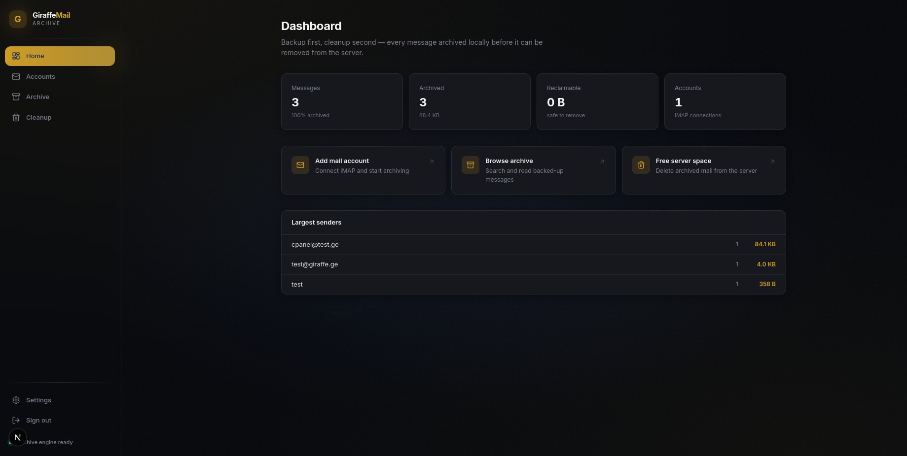
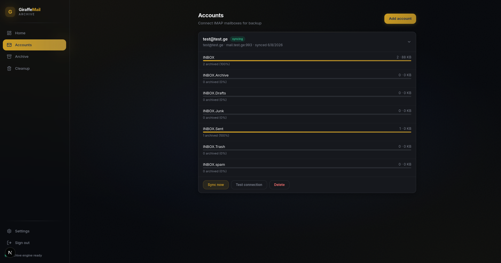
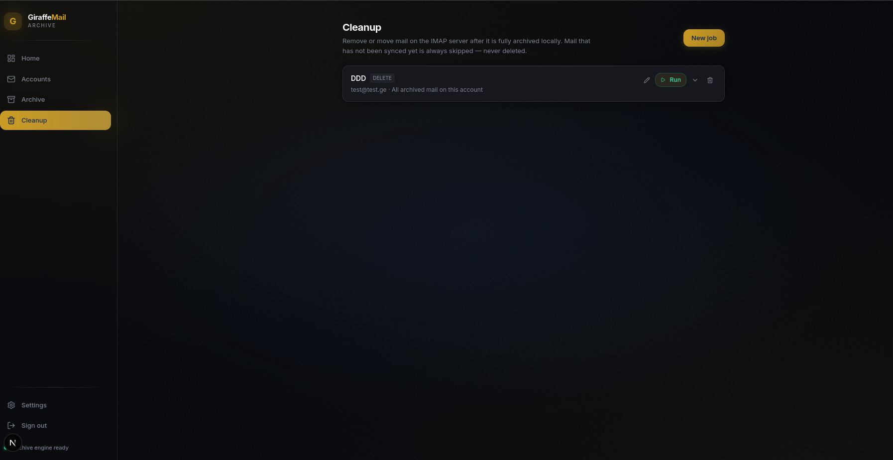

# GiraffeMail Archive

**Self-hosted email backup, archive, and safe cleanup** — one binary, SQLite + FTS5 search, content-addressed blob storage, and a modern web UI.

[](https://github.com/GiraffeSecurity/giraffemailer/actions/workflows/ci.yml)
[](LICENSE)
[](go.mod)

Built by [Giraffe.ge](https://giraffe.ge) · [Documentation](docs/README.md) · [Installation guide](docs/INSTALLATION.md) · [Report a bug](https://github.com/GiraffeSecurity/giraffemailer/issues/new?template=bug_report.yml)

---

## Why GiraffeMail?

Most mail tools either **mirror** your inbox (no safe cleanup) or **delete blindly** (data loss risk). GiraffeMail archives RFC 822 bodies locally first, verifies every blob, then allows filtered cleanup — with a **golden rule** enforced in code.

| | GiraffeMail | Typical IMAP backup | Cloud archive SaaS |
|---|-------------|---------------------|---------------------|
| Self-hosted | ✅ Single binary | Varies | ❌ |
| Full-text search | ✅ SQLite FTS5 | Often none | ✅ |
| Safe server cleanup | ✅ Golden rule | ❌ | Varies |
| No OpenSearch cluster | ✅ | — | — |
| License | AGPL-3.0 | Varies | Proprietary |

---

## Screenshots

**Dashboard**



**IMAP accounts** — live sync progress per mailbox



**Cleanup** — delete from server only after verified archive



All images: [docs/screenshots/](docs/screenshots/)

---

## How it works

```
┌──────────────┐     IMAP      ┌─────────────────┐
│ Mail server  │ ◄──────────── │ GiraffeMail     │
│ (Gmail, etc.)│               │ Archive         │
└──────────────┘               │  • index mail   │
                               │  • archive .eml │
                               │  • FTS search   │
                               │  • safe cleanup │
                               └────────┬────────┘
                                        │
                               ┌────────▼────────┐
                               │ SQLite + blobs  │
                               │ (your disk)     │
                               └─────────────────┘
```

---

## Features

- **IMAP archive** — Multiple accounts, incremental sync, zstd-compressed content-addressed blobs
- **Golden rule** — Server deletion only after verified local archive
- **Full-text search** — SQLite FTS5 with keyset pagination (no Elasticsearch required)
- **Cleanup jobs** — Filter by age, size, sender, domain, subject; preview before run
- **Export & restore** — mbox/zip export; APPEND back to IMAP
- **RBAC** — `admin` and `user` roles; users see only accounts they own
- **Security** — Encrypted credentials & blobs (AES-256-GCM), HttpOnly sessions, RBAC, rate-limited auth
- **Single binary** — Embedded Next.js UI, pure-Go SQLite (no CGO)
- **Docker** — Production-ready compose file with health checks

---

## Quick start (Docker)

```bash
git clone https://github.com/GiraffeSecurity/giraffemailer.git && cd giraffemailer
cp .env.example .env && echo "GM_SECRET_KEY=$(openssl rand -hex 32)" >> .env
docker compose up -d --build
docker compose exec giraffemail giraffemail migrate --config /etc/giraffemail/config.yaml
docker compose exec giraffemail giraffemail seed --config /etc/giraffemail/config.yaml
```

Open **http://localhost:9191/gm** → login `admin@localhost` / `admin123` → **change password immediately**.

**Full guide:** [docs/INSTALLATION.md](docs/INSTALLATION.md) (source build, binaries, troubleshooting, first IMAP account)

---

## Installation

| Method | Command / doc |
|--------|---------------|
| **Docker** (recommended) | [INSTALLATION.md § Docker](docs/INSTALLATION.md#docker-recommended) |
| **Build from source** | `make build-full` — [INSTALLATION.md § Source](docs/INSTALLATION.md#build-from-source) |
| **Cross-compile** | `make release` — [INSTALLATION.md § Binaries](docs/INSTALLATION.md#pre-built-binaries) |
| **Production deploy** | [docs/DEPLOYMENT.md](docs/DEPLOYMENT.md) (nginx, systemd, backups) |
| **Upgrade** | [docs/UPGRADING.md](docs/UPGRADING.md) |

### Requirements

| Resource | Minimum | Recommended (20 GB mail) |
|----------|---------|--------------------------|
| CPU | 1 core | 2+ cores |
| RAM | 512 MB | 2–4 GB |
| Disk | 2× mail size | 2.5× mail size |
| OS | Linux, macOS, Windows | Linux x86_64 |

Build: Go 1.22+, Node 20+ & pnpm (UI build only).

---

## The golden rule

A message is deleted from the mail server **only when**:

```
archived_at IS SET  AND  blob_sha256 IS SET (non-empty)
```

Unarchived messages are always skipped. Enforced in `internal/cleanup/gate.go`, not by convention.

---

## Configuration

Copy [`config.example.yaml`](config.example.yaml) → `config.yaml`.

| Setting | Default | Description |
|---------|---------|-------------|
| `app.env` | `dev` | `production` enables stricter validation |
| `app.secret_key` | (empty) | 64 hex chars — **required in production** (`openssl rand -hex 32`) |
| `app.port` | `9191` | HTTP listen port |
| `storage.data_dir` | `./data` | SQLite database + blob store |
| `storage.encrypt_blobs` | `false` | **true** required in production |
| `security.allow_registration` | `true` | Set **false** in production |
| `security.cookie_secure` | `false` | Set **true** behind HTTPS |

Environment overrides: `GM_SECRET_KEY`, `GM_DATA_DIR`, `GM_ENV`.

---

## CLI

| Command | Description |
|---------|-------------|
| `serve` | Start HTTP server + embedded UI |
| `migrate` | Run database migrations |
| `seed` | Create initial admin user |
| `fsck` | Verify all blobs against SHA-256 hashes |
| `export` | CLI export utilities |

```bash
go run ./cmd/giraffemail serve --config config.yaml
go run ./cmd/giraffemail fsck --config config.yaml
```

---

## Web UI

| Path | Purpose |
|------|---------|
| `/gm` | Dashboard & insights |
| `/gm/accounts` | IMAP accounts, sync progress |
| `/gm/archive` | Browse + full-text search |
| `/gm/cleanup` | Cleanup jobs & run history |
| `/gm/settings` | Password & preferences |

---

## API

REST JSON at `/api/v1/*`. Session cookie or Bearer token after login.

| Area | Endpoints |
|------|-----------|
| Auth | register, login, OTP, logout, change password |
| Accounts | CRUD, test, sync, SSE progress |
| Messages | list, get, attachments, search |
| Cleanup | preview, jobs, runs |
| Export | mbox/zip, restore to IMAP |
| Admin | user list/update (admin role) |

Full reference: [docs/API.md](docs/API.md)

Health: `GET /healthz` (liveness) · `GET /readyz` (DB readiness)

---

## Documentation

| Document | Contents |
|----------|----------|
| [**docs/README.md**](docs/README.md) | Documentation index |
| [INSTALLATION.md](docs/INSTALLATION.md) | Install, first account, troubleshooting |
| [DEPLOYMENT.md](docs/DEPLOYMENT.md) | Production, nginx, systemd, backup |
| [UPGRADING.md](docs/UPGRADING.md) | Version upgrades |
| [ARCHITECTURE.md](docs/ARCHITECTURE.md) | Layers, data flow, search |
| [API.md](docs/API.md) | HTTP endpoints & RBAC |
| [LICENSING.md](docs/LICENSING.md) | AGPL FAQ |
| [CHANGELOG.md](CHANGELOG.md) | Release history |
| [SECURITY.md](SECURITY.md) | Vulnerability reporting |
| [CONTRIBUTING.md](CONTRIBUTING.md) | Contributor guide |
| [CODE_OF_CONDUCT.md](CODE_OF_CONDUCT.md) | Community standards |

---

## Development

```bash
cp config.example.yaml config.yaml
go run ./cmd/giraffemail migrate --config config.yaml && go run ./cmd/giraffemail seed --config config.yaml

# Terminal 1
go run ./cmd/giraffemail serve --config config.yaml

# Terminal 2
cd frontend && pnpm install && pnpm dev
```

```bash
make test          # go test -race
make test-ui       # frontend vitest
make build-full    # UI + binary
```

See [CONTRIBUTING.md](CONTRIBUTING.md) for PR checklist and architecture rules.

---

## Security

- Bearer tokens (30-day TTL), bcrypt passwords, OTP flows
- RBAC: admins see all accounts; users see only owned accounts
- Rate limiting on auth (5/min/IP)
- IMAP credentials and blobs encrypted at rest when `app.secret_key` is set
- HTML sanitization (bluemonday) on message bodies
- Never commit `config.yaml` or `.env` with real secrets

**Report vulnerabilities:** [SECURITY.md](SECURITY.md) — not via public issues.

---

## License

Copyright © 2026 **Giraffe.ge** / GiraffeMail Contributors.

Licensed under [GNU AGPL v3.0](LICENSE). You may use, modify, and redistribute — including commercially — but network/SaaS deployment requires offering corresponding source to users ([AGPL §13](docs/LICENSING.md)).

For a commercial license without source-disclosure obligations, contact [Giraffe.ge](https://giraffe.ge).

---

## Tech stack

| Layer | Technology |
|-------|------------|
| Backend | Go, chi, modernc.org/sqlite, go-imap/v2 |
| Compression | zstd |
| Crypto | AES-256-GCM, bcrypt |
| Frontend | Next.js 15, TanStack Query, Tailwind v4 |
| Logging | zerolog (JSON in production) |
